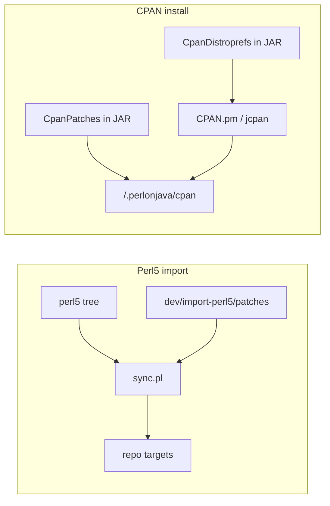

# Patch and CPAN distropref layout

**Status:** Adopted (2026-05-12). Canonical locations for Perl 5 import patches, CPAN tarball patches, and CPAN distroprefs shipped with PerlOnJava.

## Two independent pipelines

PerlOnJava touches upstream code in two different ways. Keep them mentally separate; they use different directories, tools, and patch strip semantics.

| Pipeline | When it runs | Patch / config location | Consumer |
|----------|----------------|-------------------------|----------|
| **Perl 5 import** | Developer runs `perl dev/import-perl5/sync.pl` | [`dev/import-perl5/patches/`](../import-perl5/patches/) + entries in [`dev/import-perl5/config.yaml`](../import-perl5/config.yaml) | [`dev/import-perl5/sync.pl`](../import-perl5/sync.pl) (`patch -p0` after copy from `perl5/`) |
| **CPAN install** | End user runs `jcpan` / CPAN.pm | [`src/main/perl/lib/PerlOnJava/CpanPatches/`](../../src/main/perl/lib/PerlOnJava/CpanPatches/) and [`src/main/perl/lib/PerlOnJava/CpanDistroprefs/`](../../src/main/perl/lib/PerlOnJava/CpanDistroprefs/) | [`CPAN::Config`](../../src/main/perl/lib/CPAN/Config.pm) bootstraps copies into `~/.perlonjava/cpan/patches/` and `prefs/` |

**Why not one physical `patches/` tree?** Import patches apply to paths already in the repo and use `-p0` layout from `sync.pl`. CPAN patches apply to unpacked tarballs under the CPAN build directory and paths are recorded as `Distribution-Version/file.patch` under `patches_dir`. Merging the directories would confuse tooling and docs without real benefit.

## Where to add what (contributor checklist)

1. **Vendored Perl 5 library or test files from `perl5/`**  
   - Edit [`dev/import-perl5/config.yaml`](../import-perl5/config.yaml).  
   - Add or update a file under [`dev/import-perl5/patches/`](../import-perl5/patches/).  
   - Run `perl dev/import-perl5/sync.pl`.  
   - See [`dev/import-perl5/README.md`](../import-perl5/README.md).

2. **CPAN distribution needs a patch during `jcpan -i` / CPAN test**  
   - Add `Something-1.23/Foo.pm.patch` under [`PerlOnJava/CpanPatches/`](../../src/main/perl/lib/PerlOnJava/CpanPatches/) (mirror the relative path CPAN.pm will apply).  
   - Reference it from a distropref YAML under [`PerlOnJava/CpanDistroprefs/`](../../src/main/perl/lib/PerlOnJava/CpanDistroprefs/) (`patches:` list).  
   - Register the patch file in [`CPAN::Config::_bootstrap_patches`](../../src/main/perl/lib/CPAN/Config.pm) so it is copied to `~/.perlonjava/cpan/patches/` on startup (same pattern as existing DBI / IO::Async entries).

3. **CPAN distribution needs env overrides, skipped phases, or match-only prefs**  
   - Add or edit a `Module-Name.yml` in [`PerlOnJava/CpanDistroprefs/`](../../src/main/perl/lib/PerlOnJava/CpanDistroprefs/).  
   - Register the **destination filename** (as written under `prefs_dir`, e.g. `Moo.yml`) in the `%pref_install` map inside [`CPAN::Config::_bootstrap_prefs`](../../src/main/perl/lib/CPAN/Config.pm) so bootstrap copies jar → `~/.perlonjava/cpan/prefs/`.  
   - Use a `comment:` block that mentions `PerlOnJava` so auto-updated user files remain identifiable (see below).

4. **OpenAI::API offline vs live testing**  
   - Two sources: `OpenAI-API.offline.yml` and `OpenAI-API.live.yml` in `CpanDistroprefs/`.  
   - `_bootstrap_prefs` installs exactly one of them as `OpenAI-API.yml` depending on `PERLONJAVA_OPENAI_LIVE_TESTING`.

## Bootstrap behaviour (`CPAN::Config.pm`)

On load, PerlOnJava:

1. **Prefs** — For each registered `(dest_name, src_relpath)`, read the file from `@INC` (jar or `src/main/perl/lib`) and write `~/.perlonjava/cpan/prefs/dest_name` if the destination is missing **or** exists and contains the substring `PerlOnJava` (signature that the file came from this bootstrap). Genuine user edits without that marker are left alone.

2. **Patches** — Copies each listed patch from `@INC` into `~/.perlonjava/cpan/patches/` when content is missing or out of date.

**Note on `.dd` distroprefs:** CPAN.pm only registers the `.dd` reader when YAML is unavailable ([`CPAN::Distribution::_find_prefs`](../../src/main/perl/lib/CPAN/Distribution.pm)). PerlOnJava always ships YAML; duplicate `Foo.dd` files next to `Foo.yml` are unnecessary and were removed from bootstrap.

## Stale `src/main/perl/lib/CPAN/Prefs/`

That directory is **not** used by bootstrap. Canonical prefs live under `PerlOnJava/CpanDistroprefs/`. [`CPAN/Prefs/README.md`](../src/main/perl/lib/CPAN/Prefs/README.md) points contributors to the real location.

## Related documentation

- [Using CPAN modules](../../docs/guides/using-cpan-modules.md) — `jcpan` usage and prefs/patches overview  
- [Module porting](../../docs/guides/module-porting.md) — import vs CPAN, XS/Java ports  
- [Testing reference](../../docs/reference/testing.md) — `sync.pl` in test workflows  
- [Port CPAN module skill](../../.agents/skills/port-cpan-module/SKILL.md) — agent checklist  

## Progress

| Date | Change |
|------|--------|
| 2026-05-12 | Externalized distroprefs to `PerlOnJava/CpanDistroprefs/`, CPAN tarball patches fully under `CpanPatches/`, removed redundant `.dd` bootstrap, documented two-pipeline model. |
